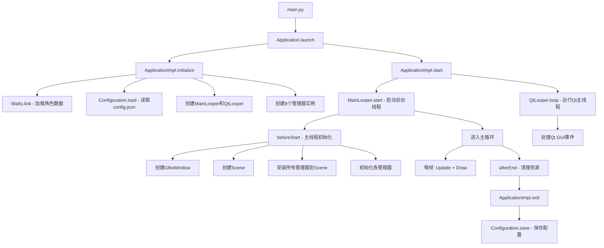

# Live2D桌面萌宠项目架构文档

## 1. 项目概述

**Live2D Mascot** 是一个基于 Python 开发的桌面宠物应用程序，支持 Live2D Cubism 2.x 和 3.0+ 模型。该项目允许用户在桌面上显示交互式动画角色，具有语音合成、表情控制、动作播放、AI对话等功能。

### 1.1 核心特性

- **双版本Live2D支持**：同时支持 Cubism 2.x 和 Cubism 3.0+ 模型
- **多角色管理**：支持多个虚拟角色（Waifu）配置和切换
- **AI对话系统**：集成多种AI聊天接口（本地OpenAI兼容API、百度千帆等）
- **实时交互**：鼠标点击、拖拽跟踪、口型同步
- **模块化设计**：清晰的分层架构，易于扩展和维护
- **配置驱动**：JSON格式配置文件，支持动态加载

### 1.2 技术栈

- **Python版本**：3.12 (Windows x64)
- **GUI框架**：PySide6 + PySide6-Fluent-Widgets
- **窗口管理**：GLFW
- **图形渲染**：OpenGL (PyOpenGL)
- **Live2D引擎**：live2d-py (Cubism 2.x & 3.0+)
- **音频处理**：Pygame
- **系统托盘**：pystray
- **图像处理**：Pillow

---

## 2. 整体架构

```
┌──────────────────────────────────────────────────────────────┐
│                      应用层 (Application)                     │
│                    ApplicationImpl                           │
├──────────────────────────────────────────────────────────────┤
│                     管理层 (Managers)                         │
│  ┌──────────┬──────────┬──────────┬──────────┬──────────┐   │
│  │ ModelMgr │ DrawMgr  │ InputMgr │ SoundMgr │ WindowMgr│   │
│  ├──────────┼──────────┼──────────┼──────────┼──────────┤   │
│  │ TextMgr  │SettingMgr│ Kizuna   │          │          │   │
│  └──────────┴──────────┴──────────┴──────────┴──────────┘   │
├──────────────────────────────────────────────────────────────┤
│                   核心抽象层 (Core)                           │
│  ┌──────────────────────────────────────────────────────┐   │
│  │  Manager | Model | Kizuna/Waifu | LiveData           │   │
│  └──────────────────────────────────────────────────────┘   │
├──────────────────────────────────────────────────────────────┤
│                 Live2D引擎适配层 (Adapter)                    │
│  ┌─────────────────────┬──────────────────────────────┐     │
│  │  Live2D V2 Adapter  │   Live2D V3 Adapter          │     │
│  └─────────────────────┴──────────────────────────────┘     │
├──────────────────────────────────────────────────────────────┤
│                   UI与视图层 (UI/View)                        │
│  ┌──────────┬──────────┬──────────┬──────────┐              │
│  │ Window   │ View     │Drawable  │Clickable │              │
│  └──────────┴──────────┴──────────┴──────────┘              │
├──────────────────────────────────────────────────────────────┤
│                  事件处理层 (Handler/Looper)                  │
│  ┌──────────┬──────────┬──────────┬──────────┐              │
│  │ Handler  │ Looper   │ Message  │MsgQueue  │              │
│  └──────────┴──────────┴──────────┴──────────┘              │
└──────────────────────────────────────────────────────────────┘
```

---

## 3. 核心模块详解

### 3.1 应用启动流程

#### 3.1.1 入口点 (main.py)

```python
from framework.runtime.application import Application
from framework.runtime.drive.application_impl import ApplicationImpl

def main():
    Application.launch(ApplicationImpl())
```

**启动流程**：
1. 创建 `ApplicationImpl` 实例
2. 调用 `Application.launch()` 静态方法
3. 执行 `initialize()` → `start()` 生命周期

#### 3.1.2 应用实现 (ApplicationImpl)

**职责**：协调所有管理器和服务的初始化与生命周期

**核心组件**：
- **SettingManager (stm)**: 设置管理（透明度、点击、跟踪等）
- **DrawManager (dm)**: 渲染管理
- **ModelManager (mm)**: 模型管理
- **InputManager (im)**: 输入管理
- **WindowManager (wm)**: 窗口管理
- **SoundManager (sm)**: 音频管理
- **TextManager (tm)**: 文本对话框管理
- **Kizuna (kizuna)**: AI对话系统
- **MainLooper**: 主循环线程
- **QtLooper**: Qt GUI线程
- **Configuration**: 配置管理

**初始化顺序**：
```
1. Waifu.link() - 链接角色数据
2. Configuration.load() - 加载配置
3. 创建 MainLooper 和 QtLooper
4. 创建所有管理器实例
5. beforeStart() - 在主线程中完成窗口、场景等初始化
6. start() - 启动主循环和Qt线程
7. afterEnd() - 清理资源
8. exit() - 保存配置
```

---

### 3.2 配置管理系统 (Configuration)

#### 3.2.1 架构特点

采用 **LiveData 观察者模式** 实现配置的双向绑定：
- **配置变更 → UI更新**：LiveData 值变化自动通知观察者
- **UI变更 → 配置保存**：UI操作修改LiveData，最终保存到文件

#### 3.2.2 配置项分类

| 类别 | 配置项 | 说明 |
|------|--------|------|
| **模型管理** | modelInfo, resourceDir | 模型信息和资源目录 |
| **场景控制** | motionInterval, drawPos, lipSyncN, scale | 动作间隔、绘制位置、口型同步、缩放 |
| **输入管理** | clickTransparent, clickEnable, trackEnable | 透明点击、点击启用、鼠标跟踪 |
| **窗口管理** | stayOnTop, visible, windowSize, windowPos | 置顶、可见性、窗口大小和位置 |
| **渲染管理** | fps | 帧率 |
| **系统托盘** | iconPath | 托盘图标路径 |
| **音频管理** | volume | 音量 (0-100) |
| **角色管理** | waifu | 当前角色对象 |

#### 3.2.3 序列化机制

```python
# 加载配置
Configuration.load(path) 
  → 解析JSON → 创建LiveData对象
  
# 保存配置
Configuration.save()
  → 提取LiveData.value → 写入JSON
```

---

### 3.3 管理器架构 (Manager Pattern)

#### 3.3.1 管理器基类

所有管理器继承自 `Manager` 基类，采用**服务定位器模式**：

```python
class Manager:
    name: str  # 管理器名称（唯一标识）
    
    @staticmethod
    def getManager(name: str) -> Manager:
        """通过名称获取管理器实例"""
```

#### 3.3.2 核心管理器列表

| 管理器 | 职责 | 实现类 |
|--------|------|--------|
| **ModelManager** | 模型加载、切换、生命周期管理 | ModelManagerImpl |
| **DrawManager** | OpenGL渲染循环、缓冲区管理 | DrawManagerImpl |
| **InputManager** | 鼠标/键盘事件捕获和分发 | InputManagerImpl |
| **WindowManager** | 窗口创建、注册、管理 | WindowManagerImpl |
| **SoundManager** | 音频播放、音量控制 | SoundManagerImpl |
| **TextManager** | 对话框弹出、文本显示 | TextManagerImpl |
| **SettingManager** | 运行时设置（透明度、点击穿透等） | SettingManagerImpl |
| **Kizuna** | AI对话系统、角色交互 | KizunaImpl |

#### 3.3.3 管理器依赖关系

```
ApplicationImpl
  ├── WindowManager ← 创建窗口
  ├── ModelManager ← 加载模型
  ├── DrawManager ← 渲染场景
  ├── InputManager ← 处理输入
  ├── SoundManager ← 播放音频
  ├── TextManager ← 显示文本
  ├── SettingManager ← 应用设置
  └── Kizuna ← AI对话
       └── 依赖: WindowManager (窗口位置/大小)
```

---

### 3.4 场景系统 (Scene)

#### 3.4.1 Scene 类职责

`Scene` 是核心视图组件，继承自 `View`，负责：
- 模型渲染和更新
- 动作自动播放调度
- 口型同步
- 用户交互处理

#### 3.4.2 组件安装模式

```python
scene.install(model_manager)   # 设置场景引用
scene.install(input_manager)   # 注册为可点击对象
scene.install(draw_manager)    # 注册为可绘制对象
scene.install(sound_manager)   # 引用音频管理器
scene.install(text_manager)    # 引用文本管理器
scene.install(kizuna)          # 引用AI对话系统
```

#### 3.4.3 更新循环

```python
def onUpdate(self):
    1. 更新模型状态 (model.Update())
    2. 获取音频RMS值，更新口型 (model.SetLipSync())
    3. 检查动作间隔，自动播放Idle动作
```

#### 3.4.4 交互处理

| 事件 | 行为 |
|------|------|
| **左键点击** | 触发模型触摸测试，播放随机动作 |
| **右键点击** | 触发AI对话 (kizuna.tell()) |
| **鼠标移动** | 更新模型拖拽点，实现眼球/头部跟踪 |

---

### 3.5 Live2D 模型系统

#### 3.5.1 双版本支持架构

```
ModelManagerImpl
  ├── V3模型: l2d_v3.LAppModel()
  └── V2模型: l2d_v2.LAppModel()
       ↓
  ModelImpl (统一包装)
       ↓
  Scene.changeModel()
```

#### 3.5.2 模型发现机制

```python
find_model_dir(version, path):
  - 扫描指定目录下的子文件夹
  - 查找 *.model.json (V2) 或 *.model3.json (V3)
  - 返回 ModelInfo 列表
```

#### 3.5.3 LAppModel 核心功能 (V2实现)

**加载流程**：
```
LoadModelJson(modelSettingPath)
  ├── 解析 model.json
  ├── 加载模型数据 (.moc)
  ├── 加载纹理 (.png)
  ├── 加载表情 (.exp)
  ├── 加载物理引擎 (.physics.json)
  ├── 加载姿态 (.pose.json)
  ├── 应用布局参数
  ├── 设置初始参数
  └── 预加载Idle动作组
```

**核心方法**：

| 方法 | 功能 |
|------|------|
| `Update()` | 更新模型状态（眨眼、呼吸、拖拽、物理） |
| `Draw()` | 渲染模型到OpenGL上下文 |
| `Touch(x, y)` | 触摸测试，触发动作 |
| `Drag(x, y)` | 更新拖拽点，实现跟踪 |
| `StartMotion()` | 播放指定动作 |
| `SetExpression()` | 切换表情 |
| `HitTest()` | 碰撞检测（点击区域） |
| `HitPart()` | 部件级碰撞检测 |

**自动动画系统**：
- **眨眼**：L2DEyeBlink 自动管理
- **呼吸**：正弦波模拟呼吸节奏
- **眼神跟踪**：根据拖拽点计算角度
- **物理模拟**：Physics引擎处理头发、衣物摆动

---

### 3.6 事件处理系统 (Handler/Looper)

#### 3.6.1 架构设计

采用类似 Android 的 **Handler-Looper-Message** 模式：

```
Thread
  └── Looper (消息循环)
       └── MessageQueue (消息队列)
            ├── Message 1
            ├── Message 2
            └── ...
  └── Handler (发送和处理消息)
```

#### 3.6.2 核心组件

**Looper**：
- 每个线程可以有一个 Looper
- 维护消息队列
- 循环处理消息

**Handler**：
- 关联到特定 Looper
- 发送消息（立即或延迟）
- 定义消息处理回调

**Message**：
- 携带数据和回调函数
- 包含执行时间戳（支持延迟）

#### 3.6.3 使用示例

```python
# 创建Handler（默认关联主Looper）
handler = Handler()

# 设置处理回调
handler.handle = lambda msg: print("处理消息")

# 发送消息
handler.post(lambda: do_something())
handler.postDelay(msg, delay=2.0)  # 延迟2秒
```

#### 3.6.4 多线程Looper

| Looper | 线程 | 用途 |
|--------|------|------|
| **MainLooper** | 后台线程 | 游戏逻辑循环（更新、渲染） |
| **QtLooper** | 主线程 | Qt GUI事件循环 |
| **KizunaLooper** | IO线程 | AI对话异步处理 |

---

### 3.7 LiveData 响应式数据

#### 3.7.1 观察者模式实现

```python
# 创建LiveData
config = LiveData(100)

# 注册观察者
config.observe(lambda value: print(f"值变更为: {value}"))

# 修改值（自动通知所有观察者）
config.value = 200
```

#### 3.7.2 线程安全观察

```python
# 指定在特定Looper上执行回调
config.observeOn(QtLooper)
config.observe(callback)  # 回调将在Qt线程执行
```

#### 3.7.3 派生类型

| 类型 | 用途 |
|------|------|
| **LiveData** | 基础响应式数据 |
| **RangeLiveData** | 范围限制的LiveData |
| **BiasRangeLiveData** | 元组中特定索引的LiveData代理 |

**应用场景**：
```python
# 窗口位置 (x, y) 是元组
windowPos = LiveData((600, 800))

# 只观察X坐标
posX = BiasRangeLiveData(windowPos, vRange=(0, 3000), bias=0)
posX.observe(lambda x: update_x_position(x))
```

---

### 3.8 UI 系统

#### 3.8.1 组件层次

```
Window (窗口)
  └── View (视图)
       ├── Drawable (可绘制)
       └── Clickable (可点击)
```

#### 3.8.2 Window 抽象

```python
class Window(ABC):
    - title: 窗口标题
    - width/height: 窗口尺寸
    - views: 视图列表
    
    抽象方法:
    - performMove()      # 移动窗口
    - performResize()    # 调整大小
    - performShow/Hide() # 显示/隐藏
    - performStayOnTop() # 置顶
    - performClose()     # 关闭
```

**实现**：`GlfwWindow` 基于 GLFW 实现

#### 3.8.3 View 生命周期

```python
class View:
    def onAttach(window):    # 附加到窗口
    def onDetach():          # 从窗口分离
    def onUpdate():          # 每帧更新
    def onDraw():            # 每帧绘制
    def onResize(w, h):      # 窗口大小变化
```

**交互事件**：
```python
def onPressed(button, x, y) -> bool
def onReleased(button, x, y) -> bool
def onDoubleClicked(button, x, y) -> bool
def onMoved(x, y) -> bool
```

---

### 3.9 Kizuna AI对话系统

#### 3.9.1 系统架构

Kizuna（羁绊）是AI对话系统的核心，管理虚拟角色的对话逻辑。

**对话流程**：
```
用户右键点击
  ↓
Kizuna.tell()
  ↓
Kizuna.prepare() - 准备输入（可能激活麦克风等）
  ↓
等待 receiver 赋值
  ↓
Kizuna.doTell(words)
  ├── beforeTell() - 预处理输入
  └── 切换到IO线程
       ↓
  Kizuna.getReaction(waifu, words)
       ├── doReaction() - 调用AI API获取回复
       ├── waifu.rethink() - 记录到对话历史
       └── 切换到主线程
            ↓
       Kizuna.onReaction(reaction)
            ├── 显示对话框
            ├── 播放语音
            └── 触发动作
```

#### 3.9.2 Waifu 角色系统

**Waifu 数据结构**：
```python
class Waifu:
    - name: 角色名称
    - desc: 角色描述（人设）
    - greeting: 问候语
    - home: 数据存储目录
    - moments: 对话时刻字典 {mid: Moment}
    - cMid: 当前对话时刻ID
```

**文件系统结构**：
```
waifus/
  └── 户山香澄/
       ├── info.json          # 角色基本信息
       └── moments/
            ├── moment_1.jsonlines  # 对话历史1
            ├── moment_2.jsonlines  # 对话历史2
            └── ...
```

**Moment（时刻）**：
- 一次连续的对话会话
- 包含多条 Hitokoto（话语）
- 以 JSON Lines 格式存储

**Hitokoto（话语）**：
```python
class Hitokoto:
    - mid: 所属时刻ID
    - speaker: 说话者 ("me" 或 角色名)
    - words: 对话内容
    - timestamp: 时间戳
    - is_ai: 是否为AI回复
```

#### 3.9.3 多角色管理

```python
# 链接所有角色
Waifu.link()
  ├── 扫描 waifus/ 目录
  ├── 加载每个角色的 info.json
  └── 创建 Waifu 对象字典

# 切换角色
kizuna.ruleBreak(waifu)
  ├── 设置 currentWaifu
  └── 加载角色人设

# 保存角色数据
kizuna.suspend()
  ├── 保存所有Waifu的info.json
  └── 保存所有Moments
```

#### 3.9.4 AI接口扩展

**接口抽象**：
```python
class Kizuna(ABC):
    @abstractmethod
    def doReaction(waifu, words) -> str:
        """调用AI API获取回复"""
        pass
```

**支持的后端**：
1. **本地OpenAI兼容API**（推荐）
   - Ollama、LM Studio、LocalAI
   - 完全免费、离线可用
   
2. **百度千帆大模型**
   - 需要API Key配置
   - 在线服务

**自定义扩展**：
修改 `framework/runtime/drive/kizuna/kizuna_impl.py` 的 `doReaction()` 方法即可接入新的AI服务。

---

### 3.10 音频系统 (SoundManager)

**功能**：
- 音频文件播放
- 音量控制
- RMS（均方根）值获取用于口型同步

**工作流程**：
```python
# 播放音频
sound_manager.play(audio_path)

# 获取RMS值（每帧调用）
updated, rms = sound_manager.getRms()
if updated:
    model.SetLipSync(rms * lipSyncN)
```

**实现**：基于 Pygame mixer

---

### 3.11 文本对话框系统 (TextManager)

**功能**：
- 弹出式对话框显示
- 自动消失（可设置超时）
- 与角色名称关联

**使用**：
```python
text_manager.popup(character_name, text, timeout=5)
```

**实现**：基于 PySide6 Fluent Widgets

---

### 3.12 设置管理系统 (SettingManager)

**管理的设置**：
- **clickTransparent**: 点击穿透（透明区域不响应点击）
- **clickEnable**: 启用点击交互
- **trackEnable**: 启用鼠标跟踪（眼球跟随）
- **stayOnTop**: 窗口置顶
- **visible**: 窗口可见性

**实现**：通过 GLFW 窗口属性控制

---

## 4. 数据流和交互

### 4.1 启动流程详细分析



### 4.2 渲染循环

```
MainLooper 线程:
  while running:
    1. InputManager.processEvents()  # 处理输入
    2. Scene.onUpdate()              # 更新逻辑
       - model.Update()              # 更新模型
       - 口型同步
       - 自动动作调度
    3. DrawManager.draw()            # 渲染
       - clearBuffer()               # 清屏
       - Scene.onDraw()              # 绘制场景
          - model.Draw()             # 绘制模型
       - swapBuffers()               # 交换缓冲区
    4. sleep(1/fps)                  # 帧率控制
```

### 4.3 用户交互流程

#### 4.3.1 左键点击

```
鼠标左键按下
  ↓
InputManager 捕获事件
  ↓
Scene.onPressed() → 返回 true (接受事件)
  ↓
鼠标左键释放
  ↓
Scene.onReleased(LEFT, x, y)
  ↓
model.Touch(x, y, onMotionStart)
  ↓
HitTest(x, y) - 碰撞检测
  ↓
找到点击区域 (area_id)
  ↓
StartRandomMotion(area_id)
  ↓
onMotionStart(name, no)
  ├── 播放关联音频 (sound_manager.play)
  └── 显示关联文本 (text_manager.popup)
```

#### 4.3.2 右键点击（AI对话）

```
鼠标右键释放
  ↓
Scene.onReleased(RIGHT, x, y)
  ↓
kizuna.tell()
  ↓
prepare() - 准备输入
  ↓
receiver.value = user_input
  ↓
doTell(words) - 在Kizuna线程执行
  ├── beforeTell() - 预处理
  └── getReaction(waifu, words)
       ├── doReaction() - 调用AI API
       ├── waifu.rethink() - 保存对话历史
       └── onReaction(reaction) - 在主线程执行
            ├── tm.popup() - 显示回复
            ├── sm.play() - 播放TTS语音
            └── mm.startMotion() - 播放表情动作
```

#### 4.3.3 鼠标移动（跟踪）

```
鼠标移动
  ↓
InputManager 捕获事件
  ↓
Scene.onMoved(x, y)
  ↓
model.Drag(x, y)
  ↓
dragMgr.setPoint(scene_x, scene_y)
  ↓
model.Update() - 每帧调用
  ↓
更新PARAM_ANGLE_X/Y/Z等参数
  ↓
模型眼球/头部跟随鼠标
```

---

## 5. 目录结构详解

```
Live2DMascot/
│
├── main.py                          # 应用入口
├── config.json                      # 主配置文件
├── requirements.txt                 # Python依赖
├── launch.bat                       # Windows启动脚本
│
├── .doc/                            # 文档目录
│   ├── CHANGES_SUMMARY.md
│   ├── LOCAL_OPENAI_GUIDE.md
│   └── QUICK_START.md
│
├── .venv/                           # Python虚拟环境
│
├── Resources/                       # 资源文件根目录
│   ├── v2/                          # Live2D Cubism 2.x 模型
│   │   └── kasumi2/
│   │       ├── kasumi2.model.json   # 模型配置文件
│   │       ├── live2d/
│   │       │   ├── *.moc            # 模型数据
│   │       │   ├── *.mtn            # 动作文件
│   │       │   ├── *.exp            # 表情文件
│   │       │   └── *.png            # 纹理贴图
│   │       └── ...
│   │
│   ├── v3/                          # Live2D Cubism 3.0+ 模型
│   │   ├── Haru/
│   │   │   ├── Haru.model3.json
│   │   │   ├── motions/
│   │   │   │   └── *.motion3.json
│   │   │   ├── expressions/
│   │   │   └── ...
│   │   ├── Hiyori/
│   │   ├── Mao/
│   │   ├── Mark/
│   │   ├── Natori/
│   │   ├── Rice/
│   │   ├── Wanko/
│   │   ├── mianfeimox/
│   │   ├── nn/
│   │   └── 波奇酱2.0/
│   │
│   ├── *.svg                        # UI图标（SVG格式）
│   └── icon.png                     # 应用图标
│
├── framework/                       # 核心框架
│   ├── __init__.py
│   │
│   ├── constant/                    # 常量定义
│   │   ├── app.py                   # 应用常量
│   │   ├── live2d.py                # Live2D版本常量
│   │   ├── mouse.py                 # 鼠标按钮常量
│   │   └── waifu.py                 # 角色默认值
│   │
│   ├── handler/                     # 事件处理系统
│   │   ├── handler.py               # Handler类（消息发送）
│   │   ├── looper.py                # Looper类（消息循环）
│   │   ├── message.py               # Message类（消息对象）
│   │   └── message_queue.py         # MessageQueue（消息队列）
│   │
│   ├── live_data/                   # 响应式数据
│   │   └── live_data.py             # LiveData观察者模式实现
│   │
│   ├── runtime/                     # 运行时核心
│   │   ├── application.py           # Application抽象类
│   │   ├── app_config.py            # Configuration配置管理
│   │   ├── main_looper.py           # MainLooper主循环
│   │   ├── scene.py                 # Scene场景类
│   │   │
│   │   ├── core/                    # 核心抽象层
│   │   │   ├── manager.py           # Manager基类
│   │   │   ├── draw_manager.py      # DrawManager抽象
│   │   │   ├── input_manager.py     # InputManager抽象
│   │   │   ├── window_manager.py    # WindowManager抽象
│   │   │   ├── sound_manager.py     # SoundManager抽象
│   │   │   ├── text_manager.py      # TextManager抽象
│   │   │   ├── setting_manager.py   # SettingManager抽象
│   │   │   │
│   │   │   ├── model/               # 模型子系统
│   │   │   │   ├── model.py         # Model抽象类
│   │   │   │   ├── model_info.py    # ModelInfo数据类
│   │   │   │   └── model_manager.py # ModelManager抽象
│   │   │   │
│   │   │   └── kizuna/              # AI对话子系统
│   │   │       ├── kizuna.py        # Kizuna抽象类
│   │   │       ├── waifu.py         # Waifu角色类
│   │   │       ├── moment.py        # Moment对话时刻
│   │   │       └── hitokoto.py      # Hitokoto话语
│   │   │
│   │   └── drive/                   # 具体实现层
│   │       ├── application_impl.py  # ApplicationImpl
│   │       ├── draw_manager_impl.py # DrawManager实现
│   │       ├── input_manager_impl.py# InputManager实现
│   │       ├── window_manager_impl.py# WindowManager实现
│   │       ├── sound_manager_impl.py# SoundManager实现
│   │       ├── text_manager_impl.py # TextManager实现
│   │       ├── setting_manager_impl.py# SettingManager实现
│   │       │
│   │       ├── model/               # 模型实现
│   │       │   ├── model_manager_impl.py # ModelManagerImpl
│   │       │   └── model_impl.py    # ModelImpl（包装V2/V3）
│   │       │
│   │       ├── kizuna/              # Kizuna实现
│   │       │   ├── kizuna_impl.py   # KizunaImpl（AI接口）
│   │       │   └── qianfan_token.py # 百度千帆Token管理
│   │       │
│   │       ├── looper/              # Looper实现
│   │       │   └── looper_impl_qt.py# QtLooper
│   │       │
│   │       └── window/              # 窗口实现
│   │           └── glfw_window.py   # GlfwWindow
│   │
│   ├── ui/                          # UI组件
│   │   ├── window.py                # Window抽象类
│   │   ├── view.py                  # View基类
│   │   ├── drawable.py              # Drawable接口
│   │   └── clickable.py             # Clickable接口
│   │
│   └── utils/                       # 工具类
│       ├── log.py                   # 日志工具
│       └── model_json.py            # 模型JSON解析
│
├── live2d/                          # Live2D引擎适配
│   ├── __init__.py
│   │
│   ├── v2/                          # Cubism 2.x 支持
│   │   ├── __init__.py
│   │   ├── lapp_model.py            # LAppModel主类
│   │   ├── lapp_define.py           # 常量定义
│   │   ├── model_setting_json.py    # model.json解析
│   │   ├── params.py                # 参数管理
│   │   ├── matrix_manager.py        # 矩阵变换管理
│   │   ├── platform_manager.py      # 平台管理
│   │   │
│   │   ├── core/                    # Cubism Core封装
│   │   │   ├── draw.py              # 绘制上下文
│   │   │   ├── log.py               # 日志
│   │   │   └── ...
│   │   │
│   │   └── framework/               # Cubism Framework封装
│   │       ├── L2DBaseModel.py      # 基础模型类
│   │       ├── L2DTargetPoint.py    # 目标点（拖拽）
│   │       ├── L2DEyeBlink.py       # 自动眨眼
│   │       └── ...
│   │
│   ├── v3/                          # Cubism 3.0+ 支持
│   │   ├── __init__.py
│   │   ├── live2d.pyd               # Windows原生库
│   │   ├── live2d.so                # Linux原生库
│   │   ├── live2d.pyi               # 类型提示
│   │   └── params.py                # 参数管理
│   │
│   └── utils/                       # 通用工具
│       ├── lipsync.py               # 口型同步工具
│       └── log.py                   # 日志工具
│
├── images/                          # 预览图片
│   ├── v2.png
│   ├── v3.png
│   └── *.gif
│
├── waifus/                          # 角色数据目录
│   ├── waifu name/
│   │   ├── info.json                # 角色信息
│   │   └── moments/                 # 对话历史
│   │       └── *.jsonlines
│   └── 户山香澄/
│       ├── info.json
│       └── moments/
│
├── test/                            # 测试代码
│   └── framework/
│       ├── handler/
│       ├── live_data/
│       ├── runtime/
│       └── util/
│
└── access_token.baidu.json          # 百度API访问令牌
```

---

## 6. 关键技术特性

### 6.1 双线程架构

**MainLooper 线程**（后台线程）：
- 执行游戏逻辑循环
- 处理模型更新和渲染
- 独立于GUI线程，保证流畅性

**QtLooper 线程**（主线程）：
- 运行Qt GUI事件循环
- 处理窗口事件
- 显示对话框和UI组件

**线程间通信**：
- 通过 Handler 跨线程发送消息
- LiveData 支持指定观察线程

### 6.2 观察者模式广泛应用

**LiveData 观察者**：
- 配置变更自动更新UI
- 模型参数变化触发重绘
- 对话状态变化更新界面

**典型应用**：
```python
# 配置绑定
drawPos.observe(lambda pos: model.SetOffset(pos[0], pos[1]))
scale.observe(lambda s: model.SetScale(s))

# 对话显示
words.observe(lambda v: text_manager.popup(name, v))
```

### 6.3 插件化AI接口

**设计原则**：
- 抽象 `Kizuna.doReaction()` 方法
- 具体实现在 `kizuna_impl.py`
- 轻松切换不同的AI后端

**扩展方式**：
```python
class KizunaImpl(Kizuna):
    def doReaction(self, waifu, words) -> str:
        # 方案1: 本地Ollama
        response = requests.post("http://localhost:11434/api/chat", ...)
        
        # 方案2: 百度千帆
        response = qianfan.ChatCompletion().do(...)
        
        # 方案3: 其他API
        return response.text
```

### 6.4 模型热切换

**机制**：
- ModelManager 监听 modelInfo LiveData
- 配置变更时自动触发 changeModel()
- 旧模型销毁，新模型加载
- Scene 自动更新引用

**优势**：
- 无需重启应用
- 配置即时生效
- 平滑过渡

### 6.5 持久化对话历史

**存储策略**：
- 每个角色独立目录
- 按"时刻"（Moment）分组
- JSON Lines 格式，便于追加和解析

**数据结构**：
```json
// moment_20240101.jsonlines
{"mid": "moment_1", "speaker": "me", "words": "你好", "timestamp": "...", "is_ai": false}
{"mid": "moment_1", "speaker": "户山香澄", "words": "你好呀！", "timestamp": "...", "is_ai": true}
```

**优势**：
- 增量写入，性能好
- 易于备份和迁移
- 支持对话上下文回忆

---

## 7. 扩展指南

### 7.1 添加新角色

**步骤**：

1. **创建角色目录**
   ```bash
   mkdir waifus/新角色名
   mkdir waifus/新角色名/moments
   ```

2. **创建 info.json**
   ```json
   {
     "name": "新角色名",
     "desc": "角色描述和人设",
     "greeting": "初次见面问候语",
     "cMid": null
   }
   ```

3. **准备Live2D模型**
   - 将模型文件放入 `Resources/v3/新角色名/` 或 `Resources/v2/新角色名/`
   - 确保 `.model3.json` 或 `.model.json` 存在

4. **修改 config.json**
   ```json
   {
     "modelInfo": {
       "name": "新角色名",
       "version": 3,
       "jsonPath": "./Resources/v3/新角色名/新角色名.model3.json"
     },
     "waifu": "waifus\\新角色名"
   }
   ```

5. **启动应用**
   - 应用会自动加载新角色
   - 对话历史自动创建

### 7.2 自定义AI接口

**步骤**：

1. **编辑 kizuna_impl.py**
   ```python
   # framework/runtime/drive/kizuna/kizuna_impl.py
   
   class KizunaImpl(Kizuna):
       def doReaction(self, waifu, words) -> str:
           # 你的AI API调用逻辑
           
           # 示例：OpenAI API
           import openai
           client = openai.OpenAI(api_key="your-key")
           response = client.chat.completions.create(
               model="gpt-3.5-turbo",
               messages=[
                   {"role": "system", "content": waifu.desc},
                   {"role": "user", "content": words}
               ]
           )
           return response.choices[0].message.content
   ```

2. **添加必要的依赖**
   ```bash
   pip install openai
   ```

3. **配置API密钥**
   - 可以在代码中硬编码（不推荐）
   - 或使用环境变量
   - 或创建单独的配置文件

### 7.3 添加新UI组件

**步骤**：

1. **创建View子类**
   ```python
   from framework.ui.view import View
   
   class CustomView(View):
       def onDraw(self):
           # OpenGL绘制代码
           pass
       
       def onUpdate(self):
           # 每帧更新逻辑
           pass
   ```

2. **添加到Scene**
   ```python
   # 在 application_impl.py 的 beforeStart() 中
   custom_view = CustomView()
   window.addView(custom_view)
   ```

3. **实现交互（可选）**
   ```python
   def onPressed(self, button, x, y) -> bool:
       if self.contains(x, y):
           # 处理点击
           return True
       return False
   ```

### 7.4 自定义动作触发

**示例：定时触发表情**

```python
# 在 Scene.onUpdate() 中添加
import time

class Scene(View):
    def __init__(self, ...):
        super().__init__()
        self.last_expression_time = time.time()
    
    def onUpdate(self):
        # ... 原有代码
        
        # 每30秒随机切换表情
        if time.time() - self.last_expression_time > 30:
            self.last_expression_time = time.time()
            self.model.SetRandomExpression()
```

---

## 8. 性能优化建议

### 8.1 渲染优化

**帧率控制**：
```json
// config.json
{
  "fps": 30  // 桌面宠物30帧足够，降低CPU占用
}
```

**模型复杂度**：
- 选择面数适中的模型
- 减少不必要的物理计算
- 禁用不需要的自动动画

```python
# 禁用自动眨眼
model.SetAutoBlinkEnable(False)

# 禁用自动呼吸
model.SetAutoBreathEnable(False)
```

### 8.2 内存管理

**模型切换**：
- 及时释放旧模型资源
- 避免同时加载多个模型

```python
# ModelManager.changeModel() 已实现
if self.__currentModel is not None:
    del self.__currentModel  # 触发垃圾回收
```

**纹理优化**：
- 使用适当分辨率的纹理
- 考虑使用纹理压缩格式

### 8.3 对话历史管理

**定期清理**：
```python
# 限制每个Moment的话语数量
MAX_HITOKOTOS = 100

if len(moment.hitokotos) > MAX_HITOKOTOS:
    moment.hitokotos = moment.hitokotos[-MAX_HITOKOTOS:]
```

**归档旧对话**：
- 将旧的Moment移动到归档目录
- 或删除超过一定时间的对话

---

## 9. 常见问题排查

### 9.1 模型无法加载

**检查清单**：
1. ✅ 模型文件路径是否正确
2. ✅ `.model.json` 或 `.model3.json` 是否存在
3. ✅ 所有引用的纹理、动作文件是否存在
4. ✅ Live2D版本是否匹配（V2/V3）
5. ✅ Python位数是否与live2d-py匹配（32/64位）

**日志查看**：
```python
# 启用详细日志
from framework.utils.log import setLogLevel
setLogLevel("DEBUG")
```

### 9.2 窗口透明/点击问题

**配置检查**：
```json
{
  "clickTransparent": false,  // true=透明区域不响应点击
  "clickEnable": true,        // 启用点击交互
  "stayOnTop": true           // 窗口置顶
}
```

**GLFW窗口标志**：
- 确保窗口创建时设置了透明标志
- 检查操作系统是否支持窗口透明

### 9.3 AI对话无响应

**排查步骤**：
1. 检查网络连接（在线API）
2. 验证API密钥配置
3. 查看控制台错误日志
4. 测试API端点是否可达

**调试技巧**：
```python
# 在 kizuna_impl.py 中添加日志
def doReaction(self, waifu, words) -> str:
    print(f"收到用户输入: {words}")
    try:
        response = call_ai_api(words)
        print(f"AI回复: {response}")
        return response
    except Exception as e:
        print(f"AI调用失败: {e}")
        return "抱歉，我现在有点累..."
```

### 9.4 音频播放问题

**检查项**：
1. ✅ Pygame mixer 是否正确初始化
2. ✅ 音频文件格式是否支持（WAV/MP3/OGG）
3. ✅ 音频文件路径是否正确
4. ✅ 系统音量是否正常

**初始化代码**：
```python
# sound_manager_impl.py
import pygame
pygame.mixer.init()
```

---

## 10. 部署和分发

### 10.1 开发环境搭建

**前提条件**：
- Python 3.12 (64位)
- Windows 10/11

**步骤**：
```bash
# 1. 克隆仓库
git clone <repository-url>
cd Live2DMascot

# 2. 创建虚拟环境
python -m venv .venv
.venv\Scripts\activate

# 3. 安装依赖
pip install -r requirements.txt

# 4. 运行应用
python main.py
```

### 10.2 打包为可执行文件

**使用 PyInstaller**：

```bash
# 安装PyInstaller
pip install pyinstaller

# 打包命令
pyinstaller --onefile --windowed ^
  --name="Live2DMascot" ^
  --icon=Resources/icon.ico ^
  --add-data="Resources;Resources" ^
  --add-data="waifus;waifus" ^
  --add-data="config.json;." ^
  --hidden-import=live2d.v2 ^
  --hidden-import=live2d.v3 ^
  main.py
```

**注意事项**：
- 包含所有资源文件
- 包含Live2D原生库（.pyd/.so）
- 测试打包后的程序

### 10.3 分发包结构

```
Live2DMascot/
├── Live2DMascot.exe       # 主程序
├── Resources/             # 模型资源
├── waifus/                # 角色数据
├── config.json            # 配置文件
└── README.txt             # 使用说明
```

---

## 11. 总结

### 11.1 架构优势

✅ **模块化设计**：清晰的分层架构，各模块职责明确  
✅ **易于扩展**：插件化的AI接口、管理器模式  
✅ **响应式编程**：LiveData观察者模式简化状态管理  
✅ **双版本支持**：同时兼容Live2D V2和V3  
✅ **多线程架构**：GUI和逻辑分离，流畅性好  
✅ **配置驱动**：JSON配置，无需修改代码即可定制  

### 11.2 适用场景

- 🎮 桌面宠物应用
- 💬 AI虚拟助手
- 🎭 Live2D模型展示工具
- 📚 Live2D学习参考项目

### 11.3 未来改进方向

🔮 **可能的增强**：
- [ ] 支持更多AI后端（Claude、Gemini等）
- [ ] 语音识别输入（STT）
- [ ] 更丰富的表情和动作系统
- [ ] 云端对话同步
- [ ] 插件系统（动态加载功能模块）
- [ ] Web控制面板
- [ ] 多语言支持

---

## 附录

### A. 关键类图

```
┌─────────────────────────────────┐
│       Application (abstract)    │
├─────────────────────────────────┤
│ + initialize()                  │
│ + start()                       │
│ + exit()                        │
│ + launch(app) [static]          │
└──────────┬──────────────────────┘
           │ implements
┌──────────▼──────────────────────┐
│      ApplicationImpl            │
├─────────────────────────────────┤
│ - stm: SettingManager           │
│ - dm: DrawManager               │
│ - mm: ModelManager              │
│ - im: InputManager              │
│ - wm: WindowManager             │
│ - sm: SoundManager              │
│ - tm: TextManager               │
│ - kizuna: Kizuna                │
│ - appConfig: Configuration      │
├─────────────────────────────────┤
│ + initialize()                  │
│ + beforeStart()                 │
│ + start()                       │
│ + afterEnd()                    │
└─────────────────────────────────┘

┌─────────────────────────────────┐
│        Manager (abstract)       │
├─────────────────────────────────┤
│ + name: str                     │
│ + getManager(name) [static]     │
└──────────┬──────────────────────┘
           │ extends
     ┌─────┴─────┬─────────┬──────────┐
     │           │         │          │
┌────▼────┐ ┌───▼────┐ ┌──▼─────┐ ┌──▼──────┐
│ModelMgr │ │DrawMgr │ │InputMgr│ │SoundMgr │
│         │ │        │ │        │ │         │
└─────────┘ └────────┘ └────────┘ └─────────┘
```

### B. 配置文件示例

```json
{
    "modelInfo": {
        "name": "Haru",
        "version": 3,
        "jsonPath": "./Resources/v3/Haru/Haru.model3.json"
    },
    "resourceDir": "./Resources",
    "motionInterval": 10,
    "drawPos": [0, 0],
    "lipSyncN": 1.0,
    "scale": 1.0,
    "clickTransparent": false,
    "clickEnable": true,
    "trackEnable": true,
    "stayOnTop": true,
    "visible": true,
    "windowSize": [200, 300],
    "windowPos": [1641, 617],
    "fps": 30,
    "iconPath": null,
    "volume": 100,
    "waifu": "waifus\\户山香澄"
}
```

### C. 参考资料

- [Live2D Cubism SDK](https://www.live2d.com/en/download/cubism-sdk/)
- [live2d-py](https://github.com/Arkueid/live2d-py)
- [PySide6 Documentation](https://doc.qt.io/qtforpython/)
- [GLFW Documentation](https://www.glfw.org/docs/latest/)
- [Pygame Documentation](https://www.pygame.org/docs/)

---

**文档版本**: 1.0  
**最后更新**: 2026-05-18  
**作者**: Lingma AI Assistant
